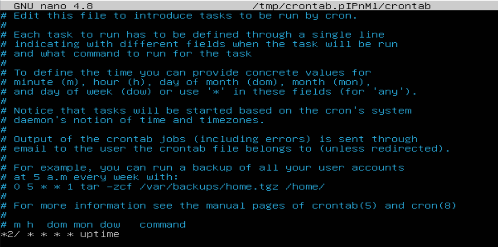

## Часть 1. Установка ОС

Команда для проверки **`cat /etc/issue`**.
___
## Часть 2. Создание пользователя
##

команда для проверки **`cat /etc/passwd`**.
___

## Часть 3. Настройка сети ОС

**1) Установите имя машины как user-1.**
Использовал команду: **`sudo hostnamectl set-hostname user-1`**

**2) Установите часовой пояс.**
Использовал команду:**`sudo timedatectl set-timezone 'Europe/Moscow'`**

**3) Выведите имена сетевых интерфейсов.**
Использовал команду:
**`ip link`**

lo: Это loopback интерфейс, используемый для внутренней коммуникации в системе. Состояние UP означает, что интерфейс активен

**4) Используя консольную команду получи ip адрес устройства, на котором ты работаешь, от DHCP сервера.**

**`sudo dhclient -r`**(для отключения)
**`sudo dhclient`** (для назначения нового адреса)

**`ip route`** (показывает IP адрес) (так же для использование данной кманды с начало нужно установить пакет обновлений. Команда для терминале **`sudo apt install net-tools`** (так же можно использовать **`ifconfig`** для получения IP)._
 где    
**default** - указывает, что это маршрут по умолчанию, используемый для отправки трафика, не предназначенного для локальной сети.
**via 10.0.2.2** _- это IP-адрес шлюза по умолчанию. Все трафик, адресованный за пределы вашей локальной сети, будет направлен через этот шлюз.
**dev enp0s3** _- означает, что этот маршрут использует сетевой интерфейс enp0s3. В зависимости от  системы и конфигурации, здесь может быть указан другой интерфейс, например wlan0 для беспроводного соединения.
**proto dhcp** _- означает, что маршрут был получен через DHCP (Dynamic Host Configuration Protocol).
**metric 100** _- это метрика маршрута, которая используется для определения предпочтительности маршрута, если существует несколько маршрутов.

__Что такое DHCP:__
_DHCP (Dynamic Host Configuration Protocol) — это сетевой протокол, который используется для автоматического назначения IP-адресов и другой важной сетевой информации устройствам в сети._

__Как работает DHCP:__
_Когда устройство подключается к сети, оно отправляет широковещательный запрос (DHCPDISCOVER) для поиска DHCP-серверов.
DHCP-сервер получает этот запрос и отвечает, отправляя предложение (DHCPOFFER) с IP-адресом и другой сетевой информацией, такой как маска подсети, шлюз по умолчанию и адреса DNS-серверов.
Устройство выбирает одно из предложений и отправляет запрос (DHCPREQUEST) на сервер, чтобы подтвердить, что оно принимает предложенный IP-адрес.
DHCP-сервер подтверждает этот запрос, отправляя подтверждение (DHCPACK) и формально назначая IP-адрес устройству._

**5) Определи и выведи на экран внешний ip-адрес шлюза (ip) и внутренний IP-адрес шлюза, он же ip-адрес по умолчанию (gw).**

_Использовал команду **`ip route`** для получения внешнего IP адреса._

**6) Задай статичные (заданные вручную, а не полученные от DHCP сервера) настройки ip, gw, dns (используй публичный DNS серверы, например 1.1.1.1 или 8.8.8.8).**

Использовал команду **`sudo nano /etc/netplan/00-installer-confit.yaml`** и заполнял по шаблону

после чего нужно сахранить изменения командой **`ctrl+x`**>> **`y`**>>**`enter`** и после всего консоли прописать команду **`sudo netplan apply`**(что бы наш файл заработал)

**7) Перезагрузи виртуальную машину. Убедись, что статичные сетевые настройки (ip, gw, dns) соответствуют заданным в предыдущем пункте.**

-использовал команду **`reboot`**(для перезагрузки системы)
-ипользовал команду **`ip route`**(для подтвержения что настройки из пункта 6 были успешно выполненны)

-Далее использовал команды **`ping 1.1.1.1`** **`ping 8.8.8.8`** и **`ping ya.ru`**. 

____

## Часть 4. Обновление ОС
Для обновления ОС необходимо прописать команду в терминале **`sudo apt upgrade`**.
 на скрине видно что у пользователя есть выбор обновить или нет,что бы обновление пошло нужно в терминале прописать **`Y`** или **`Д`** после чего начнеться обновление 
 на это обновление ОС завершенно. 
**P.S
Обновление происходит не у всех пользователей потому что УЖЕ было обновленно до последнего пакета.**
____

## Часть 5. Использование команды sudo

ЧТО ТАКОЕ СУДО И С ЧЕМ ЕГО ЕДЯТ

Что бы разрешить пользователю выполнять команду **`sudo`** необходимо прописать команду **`sudo usermod -aG sudo driade007`**
(driade007 меняем на имя своего user)

Флаг -aG расшифровывается как add и group. То есть мы добавляем пользователя в группу sudo, сохраняе его членство в других группах.

Далее, от имени пользователя требуется поменять hostname ОС используя sudo. Для выполнения этой задачи выполним команду **`sudo -u driade007 sudo hostnamectl set-hostname new_driade007`** и перезагрузить машину используя **`reboot`**.

После перезагрузки мы видим что имя пользователя было изменнено 
.
____

## Часть 6. Установка и настройка службы времени

Использовал команду  **`NTPSynchronized=yes: timedatectl show`**

## Часть 7. Установка и использование текстовых редакторов 
____

**Тексовы редактор VIM**
для начала нам необходимо создать **`txt`** файл пишем в консоли **`vim test_VIM.txt`**,далее открываем файл с помощью тойже команды и начинаем его редактировать.

Для того что бы перейти в режим ввода текста нужно нажать **`i`**- переход в режим ВВОДА, далее нажимаем сочитание клавиш **`ctrl+c`** для выхода с данного режима.
Что бы открыть строчку для ввода команды внизу необходима нажать **`shift+;`** далее мы видим,что внизу у нас замигала строка для ввода команды, в ней пишем **`qw`** и нажимает **`Enter`** (для сохранения и выхода их файла)

**Текстовый редактор NANO**
для начала нам необходимо создать **`txt`** файл пишем в консоли **`vim test_NANO.txt`**,далее открываем файл с помощью этой же команды и начинаем его редактировать.

Для того что бы сохранить набранный текс необходимо нажать сочитаение клавишь **`ctrl+x`**,далее нажимает **`Y`** после чего редактор спросит "Необходимо ли переиминовать наш txt файл?" если в этом нет необходимости просто нажимаем **`Enter`**.

**Текстовый редактор JOE**
Для началы работы с тексовым редактором **`joe`** необходимо его утсановить с помощью команды **`sudo apt install joe `**
Далее мы создаем наш txt файл с помощью команды **`joe test_JOE.txt`**,что бы открыть наш файл вводим туже команду.

Перед нами открывается окно в которомы мы вводим наш текст,для того что бы его сохранить необходимо использовать сочитание клавишь **`Ctrl+k`** далее нажимаем людумаю клавишу на клавиатуре после чего редактор спросить "необходимо ли переиминовать файл?" если в этом нет необходимости нажимает **`Enter`** после успешного сохранения мы нажимает сочитаение клавишь **`Ctrl+c`** и наслаждаемся результатом.

**Выход из Тексового редактора VIM без сохранения**

Для начала нам необходимо открыть наш файл с помощью команды **`vim test_VIM.txt`**, затем мы меняем наш текст с **Driade007** на **21 school 21**
Для выхода из редактора без сохранения нам необходим открыть строчку ввода с помощью команды **`Shift+;`** далее вводим команду **`q!`** и нажимает **`Enter`** тем самым мы не сохраняем наши изменения в файле 

**Выход из Тексового редактора NANO без сохранения**

Для начала нам необходимо открыть наш файл с помощью команды **`nano test_NANO.txt`**, затем мы меняем наш текст с **Driade007** на **21 school 21**
Для выхода из редактора без сохранения нам необходим использовать сочитание клавишь **`Ctrl+x`**,затем редактор спросить "необходимо ли сохранить внесенные изменения" мы нажимаем на клавишу **`n`** тем самым мы не сохраняем наши изменения в файле 

**Выход из Тексового редактора JOE без сохранения**
Для начала нам необходимо открыть наш файл с помощью команды **`nano test_JOE.txt`** , затем мы меняем наш текст с **Driade007** на **21 school 21**
Для выхода из редактора без сохранения нам необходим использовать сочитание клавишь **`Ctrl+x`**,затем редактор спросить "отменить изменения файла?" мы нажимаем на клавишу **`y`** тем самым мы не сохраняем наши изменения в файле 

**Поиск и замена текста в VIM**
Для начала нам необходимо открыть наш файл с помощью команды **`vim test_VIM.txt`**.Далее открывае строку для ввода команды.
Для поиска совпадений в файле в командном режиме нажимаем на клавишу **`/`** а далее искомое слово.(В моем случаи driade007).

Для замены слова используется команда: **`%s/поиск/замена/`**
Где поиск- driade007,а замена - 21_school_21.

**Поиск и замена текста NANO**
Для начала нам необходимо открыть наш файл с помощью команды **`nano test_NANO.txt`**.
Для поиска слова используем сочитание клавишь **`Ctrl+w`**

Для замены текста используем сочитание клавишь **`Ctrl+\`**
Появится строка в которой  необходимо ввести слово которое мы будем с вами меня после нажимае **`Enter`** и уже вводим слова на которое мы меняем и снова нажимаем **`Enter`** и мы с вами увидим успешную замену текса.

**Поиск и замена текста JOE**
Для начала нам необходимо открыть наш файл с помощью команды **`joe test_JOE.txt`**.
Для поиска слова используем сочитание клавишь **`Ctrl+K,F`**

Далее мы вводим слово которое ищем.

Для замены текста используем сочитание клавишь **`Ctrl+K,F`**
Появится строка в которой  необходимо ввести слово которое мы будем с вами меня после нажимае **`Enter`** перед вами появиться строка с выбором действий необходимо прописать **`r`** и нажать **`Enter`** после этого уже вводим слова на которое мы меняем и снова нажимаем **`Enter`**, далее необходимо подтвердить действие нажатием клавищи **`y`** и мы с вами увидим успешную замену текса.

_P.S
Ползунок долже стоять перед текстом что бы поиск прошел успешно!!! в противном случаи он будет искать слова которые идут дальше ползунка,тем самым может сбить вас с толку,но мы с вами справились._
____

## Часть 8. Установка и базовая настройка сервиса **SSHD**
**что же такое SShd?**
SSHd (Secure Shell Daemon) - это серверная часть протокола Secure Shell (SSH), который обеспечивает защищенное удаленное подключение к компьютеру или серверу. SSHD работает на сервере и слушает определенный TCP-порт (по умолчанию порт 22) для входящих SSH-соединений.

Как и всегда нам необходимо установить пакет обновлений SSHd для этого используем команду **`sudo apt install openssh-server`**

Для добавления автостарта необходимо ввести команду **`sudo systemctl enable ssh`**

systemctl: Это основная утилита для управления системным менеджером systemd. Она используется для запуска, остановки, перезапуска, включения и отключения служб, а также для проверки их статуса.

Что бы провреить все ли верно мы сделали необходимо перезапустить машину с помощью команды **`sudo reboot`**, после перезагрузки вводи команду **`systemctl status ssh`** и убеждаемся что служба работает (выделена зеленым цветом)

Далее нам необходимо перенастрой службу SSHd на порт 2022.
Для этого вводим команду  **`sudo nano /etc/ssh/sshd_config`** (текстовы редактор можно использовать любой я выбрал nano).

когда откроешь файл необходимо найти строчку под название **#port 22** мы меняем данную данную строчку на **port 2022** удаляя символ **#** после чего сахраняем файл и закрываем его.

Что бы показать наличие процесса ssh необходимо ввести команду `**ps -e | grep sshd**`
так же можно использовтаь ключ **`-aux`** (для получения более детальной информации)

**Ключ -е** 
Этот ключ указывает команде ps показать все процессорные процессы, независимо от того, к какому пользователю они принадлежат или каким терминалом управляются.
Команда ps -e предоставит список всех запущенных процессов в системе.
Обычно эта команда выводит ограниченное количество информации о каждом процессе, такой как его идентификатор (PID) и имя команды.
**Ключ -aux**
 Комбинация ключей aux в команде ps предоставляет более детальную информацию о процессах, включая процессы, запущенные разными пользователями.
a означает, что нужно показать процессы всех пользователей.
u добавляет подробную информацию о пользователе, владеющем процессом, а также об использовании CPU и памяти.
x включает процессы, которые не привязаны к терминалу. Это важно для отслеживания фоновых процессов или служб, таких как sshd.
Команда ps aux выводит широкий спектр информации, включая пользователя, который владеет процессом, использование CPU и памяти, идентификатор процесса (PID), родительский идентификатор процесса (PPID), и многое другое.

Далее просто перезагружаем систуму командой **`reboot`**

После перезагрузки вводи команду **`netstat -tan`**

(если команда отсутствует ее можно скачать с помощью **`sudo apt-get install net-tools`**)

**Ключ -tan**
-t: Показывает TCP соединения.
-a: Отображает все соединения и прослушивающие порты.
-n: Показывает числовые адреса вместо пытаться определить символические имена хостов.

**Значение каждого столбца вывода, значение 0.0.0.0.**

Каждый столбец в выводе команды **`netstat -tan`** имеет свое специфическое значение:

**Proto**: Показывает тип протокола сетевого соединения. В случае использования флага -t, вы будете видеть только TCP соединения.

**Recv-Q**: Обозначает количество байт, которые были получены сетью и ожидают чтения со стороны приложения. Если этот номер не равен нулю, это может указывать на то, что приложение не обрабатывает входящие данные достаточно быстро.

**Send-Q**: Показывает количество байт, которые были отправлены приложением, но еще не подтверждены как полученные другой стороной. Если этот номер высок, это может указывать на проблемы с сетевым соединением или на то, что удаленный хост не обрабатывает входящие данные.

**Local Address**: Показывает IP-адрес и порт локальной машины, участвующие в соединении. Если вы видите 0.0.0.0 или :::, это означает, что машина принимает соединения на этом порте со всех IP-адресов.

**Foreign Address**: Показывает IP-адрес и порт удаленной машины, участвующие в соединении. Если здесь стоит 0.0.0.0:* или *:*, это означает, что соединение находится в состоянии ожидания или прослушивания и не подключено к определенному удаленному адресу.

**State**: Отображает текущее состояние соединения. Например, LISTEN означает, что система ожидает входящих соединений на этом порту, ESTABLISHED означает, что соединение успешно установлено, и данные могут передаваться между хостами.

В контексте IP-адреса "0.0.0.0" и "0:0:0:0", каждый ноль имеет следующее назначение:

**Первый ноль** означает, что адрес находится в сети класса A.
**Второй ноль** указывает, что адрес находится в подсети сети класса A.
**Третий ноль** указывает на конкретную сеть или хост в этой подсети.
В контексте "0.0.0.0" в IPv4, он обычно используется для указания нулевого адреса или адреса всех сетей. В сетевом программировании он обозначает "любой IP-адрес" или "любой доступный сетевой интерфейс".

____
## Часть 9. Установка и использование утилит **top**, **htop**

вводим в терминале команду **`top`** и начинаем анализировать данные 
**Uptime**: 22 минуты

**Количество пользователей**: 1 пользователь

**Общая загрузка системы** за последние 1, 5 и 15 минут соответственно: 0.00, 0.00, 0.00

**Общее количество процессов**: 130 процессов, из которых 1 запущен, остальные спят

**Загрузка CPU**: 0.0% us (пользовательская), 0.0% sy (системная), 0.0% ni (приоритет), 100.0% id (простой), 0.0% wa (ожидание ввода/вывода), 0.0% hi (аппаратные прерывания), 0.0% si (программные прерывания), 0.0% st (время, украденное у виртуальной машины)

**Загрузка памяти**: 3672,3 MiB всего, 3134,0 MiB свободно, 178,7 MiB использовано, 359,6 MiB буфер/кэш

**pid процесса занимающего больше всего памяти**- 438

**pid процесса, занимающего больше всего процессорного времени** - 3255

Далее вводим команду **`htop`** и начинаем делать сортировку по заданным параметрам,что бы выбрать по какому параметру мы хотим сортировать необходимо использовать **`F6`**

**Сортировка по PID**

**Сортировка по CPU**

**Сортировка по MEM**

**Сортировка по TIME**

**Сортировка по sshd**
 Для того что бы сделать фильтрацию на **`sshd`** необходима использовать клавишу **`|`** далее откроется строка для поиска и туда вводим **`sshd`**
 

 **с процессом syslog, найденным, используя поиск**

 для поиска необходимо использовать **`F3`** далее вводим **`syslog`**
 

 **c добавленным выводом hostname, clock и uptime** 
Необходимо перейти в настрой для этого используем **`F2`** и находим раздел **`Available meters`** далее переносим необходимые нам параметры.

## Часть 10. Использование утилиты **fdisk**

**fdisk (Fixed Disk)** - это командная утилита в Linux, которая используется для работы с разделами на жестком диске. С ее помощью вы можете создавать, изменять, удалять и просматривать разделы на диске.

Запускаем команду **`fdisk -l`**. На экране появляется информация о жестком диске.

**Имя диска** - VBOX HARDDISK

**Размер** - 50.29GiB

**Количество секторов** - 105456768

swap size можно получить с помощью команды **`free -h`**

**Размер Swap** - 3.6Gi

## Часть 11. Использование утилиты **df** 

**Команда df (Disk Free)** используется для вывода информации о доступном пространстве на файловых системах в Linux. По умолчанию, df выводит информацию о размере, использованном и доступном пространстве в блоках данных.

Вводим в терминале команду **`df`**
получаем информацию о доступном пространстве на файловых системах в Linux.

  - **размер раздела**-24739620
  - **размер занятого пространства**-6509300
  - **размер свободного пространства**-16948272
  - **процент использования**-28%
  - **Определи и напиши в отчёт единицу измерения в выводе**.- измерения в килобайтах.

далее запускаем команду **`df -Th`**

**Флаг -T (или —print-type)** используется для отображения типа файловой системы каждой отдельной записи в выводе команды df. Это полезно, если вам требуется знать типы файловых систем, используемых на различных дисках или разделах.

**Флаг -h (или —human-readable)** используется для вывода размеров в человеко-читаемом формате. Он преобразует размеры в более понятные единицы измерения, такие как килобайты (K), мегабайты (M), гигабайты (G) и т.д. Это делает вывод более удобным для чтения и понимания.

 - **размер раздела**-24G
  - **размер занятого пространства**-6.3G
  - **размер свободного пространства**-17G
  - **процент использования**-28%
  - **Определи и напиши в отчёт тип файловой системы для раздела.**- ext4

  ## Часть 12. Использование утилиты **du**

  **Команда du (Disk Usage)** в Linux используется для вычисления и вывода информации о занятом дисковом пространстве файлами и директориями. Она позволяет определить, сколько места занимает каждый файл или директория в файловой системе.

  Для того что бы вывести размер данных папо необходимо в терминале прописать команду **`sudo du -sh /var/log /var /home`** 

**Флаг -s (или —summarize)** в команде du используется для вывода только общего размера заданной директории или файлов. Он позволяет получить только сводную информацию о занимаемом дисковом пространстве без вывода подробного списка файлов и директорий.

**Флаг -h (или —human-readable)** в команде du используется для вывода размеров файлов и директорий в человеко-читаемом формате. Он преобразует размеры в более понятные единицы измерения, такие как килобайты (K), мегабайты (M), гигабайты (G) и т.д.
  
  
  - **размер папок**
    - **/home**- 132Килобайта 
    - **/var**- 670 Мегабайт
    - **/var/log**- 60 Мегабайт

Для просмотра всего содержимого в /var/log необходимо прописать в терминале команду **`sudo du -sh /var/log/*`**

  
____

## Часть 13. Установка и использование утилиты **ncdu**

**Ncdu (NCurses Disk Usage)** - это интерактивная утилита командной строки для анализа использования дискового пространства в Linux. Она предоставляет древовидное представление размеров файлов и директорий, позволяя быстро и удобно определить, какие файлы и директории занимают больше всего места на диске.

Для начала необходимо утсановить **`Ncdu`** для этого используем команду **`sudo apt install ncdu`**

далее определяем размер необходимых папок:

- вводим команду **`ncdu /home`**

размер папки /home - 128 Килобайт что примерно равно размеру указанному в части 12

- вводим команду **`ncdu /var`**

размер папки /var - 727 Мегабайт что примерно равно размеру указанному в части 12

- вводим команду **`ncdu /var/log`**

размер папки /var - 56 Мегабайт что примерно равно размеру указанному в части 12

## Часть 14. Работа с системными журналами

c помощью текстового редактора vim открываем файл **`/var/log/dmesg`**. Используем команду **`vim /var/log/dmesg`**:

перезагружаем службу sshd командой **`sudo systemctl restart sshd`**

c помощью текстового редактора vim открываем файл **`/var/log/sys;og`**. Используем команду **`vim /var/log/syslog`**:

по содержимому файла syslog видим что перезагрузка произошла в 03:36:02

c помощью текстового редактора vim открываем файл **`/var/log/auth.log`**. Используем команду **`vim /var/log/auth.log`**:

последний вход в систему совершил пользователь driade007 13 января в 03:46, метод входа - pam_unix

## Part 15. Использование планировщика заданий **CRON**

Чтобы запускать команду uptime через каждые 2 минуты откроем файл заданий командой **`sudo crontab -e`**
система предложит выбрать текстовый редактор для открытия файла. Выбираем nano.

добавляем в файл строчку **`*/2 * * * * uptime`**. Эта строка использует синтаксис cron, где */2 указывает на запуск каждые 2 минуты. Каждая звездочка представляет одну из пяти временных единиц, а именно минуты, часы, дни месяца, месяцы и дни недели.
список текущих заданий для CRON:

выводим содержимое файла системного жернала команда **`vim /var/log/syslog`**, чтобы убедиться, что задания выполняются(последние строчек)разница во времени выполнения 2 минуты

Чтобы удалить все задания из планировщика заданий cron вызываем команду **`crontab -r`**
Для просмотра списка текущих заданий для CRON вызываем команду **`crontab -l`** и убеждаемся, что список пуст:

